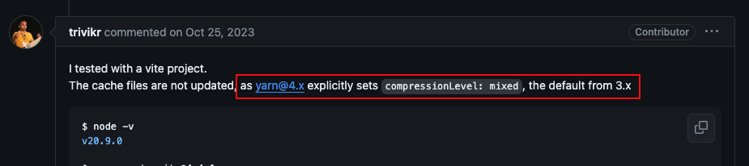

과연 Zero-Install을 쓰지 않는 Yarn berry는 앙코없는 찜빵이 될까요?🧑‍🍳

## Intro

이전 회사에서 근무할때 국제화 addon 기능을 활용하여 UI 컴포넌트를 테스트하기 위해 `Storybook` 도입을 담당했던 경험이 있습니다. Storybook v8은 yarn berry 버전 이상의 환경이 요구되었고 이를 대처하기 위한 마이그레이션 과정 중 `유령 종속성`과 `PnP`, `zero-install` 그리고 또 다른 패키지 매니저 `pnpm`을 알게되었습니다.  
<br/>
결과적으로 yarn berry v4로 `zero-install`을 적용했지만, 당시 `unplugged` 용량이 적지 않아 가장 기대하고 있었던 `DX적인 부분`에서 드라마틱한 효과는 볼 수 없었습니다. 빌드 시간은 조금 줄어들었지만, `브랜치를 옮겨다닐때마다 종속성을 깔고 지우는 루틴`은 바뀌지 않았기 때문입니다.

### 안정적이지 않은 상태의 기능이라면 당장 사용해야하는 이유가 있을까?

yarn에서도 [v4 릴리즈 노트에서 zero-install을 더이상 디폴트 설정으로 활성화하지 않겠다](https://yarnpkg.com/blog/release/4.0)는 결정을 했습니다. 케이스마다 효과가 다른 변동성을 가진 zero-install을 버린다면 확실하게 남는 기능은 `PnP`입니다.

문득 yarn의 간판 기능인 `zero-install을 버리고 PnP만 차용하더라도 다른 패키지 매니저에 비하면 더 나은 선택일까?` 라는 의문이 들었습니다. 유령 종속성 문제를 해결하는 기능이라면 `pnpm`으로도 동일한 효과를 볼 수 있기 때문입니다.

### 그래서 zero-install을 사용하지 않는다면 yarn berry (with pnp) OR pnpm?

마이그레이션 작업을 했던 당시를 회고하며, `pnpm`과 비교한다면 `PnP 기능만 차용한 yarn berry의 성능적 이점`에는 무엇이 있을지 직접 확인해보고 그 과정을 작성해보겠습니다.
<br/>

---

## 개발 환경 조건

최대한 동일하고 기본적인 환경에서 비교를 시작하기 위해, 몇가지 조건을 설정하였습니다.
- [공통] build 결과물을 `'standalone'으로 경량화한 Next.js 기본 제공 템플릿`을 시작점으로 사용
- [yarn berry] zero-install을 사용하지 않고, `nodeLinker를 PnP로 설정`합니다.

    ||yarn berry (PnP)|pnpm|
    |:------:|:------:|:------:|
    |Node|v20.11.1|v20.11.1|
    |Next.js|v14.2.5 (standalone build)|v14.2.5 (standalone build)|
    |Version|v4.3.1|v.9.5.0|

## 비교 조건
최초 빌드를 기준으로 하기위해 workflow 캐시 작업은 제외하였습니다.   
`pnpm`의 경우 `pnpm store prune` 명령어로 pnpm의 cache를 삭제 후 측정하였습니다.   
docker의 이미지 build 시간은 `--no-cache 플래그`를 사용하여 캐시 없이 최초 측정을 작성하였습니다. 
<br/>
🔎 대략적인 수치를 알기 위한 것으로, 케이스마다 오차가 있을 수 있습니다.

- [Local/Docker/Workflow] dependency install 시간
- [Docker] 로컬 이미지 build 시간
- [Github Actions] CI total workflow 시간
- [Github Actions] Build Job, Build & Docker Push Step 시간

<br/>
---

## 과정 1) Dependency Install 시간
### ✅ pnpm (workflow, local docker -70%)
PnP로 압축된 종속성 크기 차이의 영향으로, 종속성 크기는 약 26% 작게, install 시간은 약 90% 빠르게 로컬에서 측정되었지만,  
(로컬 yarn berry: 684ms, 로컬 pnpm: 8.1s)   

|yarn berry (.yarn 크기): `187mb(70mb+117mb)` (-26%)|pnpm (node_modules 크기): `255mb`|
|:------:|:------:|
|||

<br/>
실제로 `workflow`에서는 `반대로 pnpm이 yarn berry에 비해 약 70% 빠르게 측정`되었습니다.   

`zero-install을 사용하지 않는 yarn berry`는 PnP방식으로 종속성을 경량화하더라도 `docker에서 최초 install하는 과정`이 필요하기 때문에 로컬을 제외하면 꽤 `많은 시간을 설치에 소비`하고 있었습니다.

이와 유사하게 로컬 docker image build 중 yarn의 종속성 설치 시간 또한 `workflow 환경과 비슷한 결과`를 보여주고 있었습니다. (16.5s)

|yarn berry (install 시간): workflow:`16.1s`|
|:------:|
||

|yarn berry (install 시간): 로컬 docker:`16.5s`|
|:------:|
||

|pnpm (install 시간): workflow:`5.0s` (-70%)|
|:------:|
||

|pnpm (install 시간): 로컬 docker:`11.7s` (-30%)|
|:------:|
||

## 과정 2) Docker Image Build 시간
### ✅ pnpm (-14%)
docker image 크기가 약 35% 작게, image build 시간은 약 14% 빠르게 측정되었습니다.  

|yarn berry (이미지 사이즈): `235mb`|
|:------:|
||

|pnpm (이미지 사이즈): `151.75mb` (-35%)|
|:------:|
||

<br/>

yarn berry는 `시작할때 종속성 크기는 작았지만, zero-install 기능을 쓰지 않기에`, 오히려 빌드 단계에서 install을 하고 여러가지 파일들 (yarn폴더 내부 release/yarn-4.3.1.cjs, .pnp.cjs, .pnp.loader.mjs 등)을 `COPY 명령어로 install 레이어로 가져오는 단계가 많아 시간이 소비`되었습니다.

이러한 이유로 종속성 크기가 더 작은 yarn berry가 pnpm보다 workflow 시간이 느리게 측정되었습니다. 

|yarn berry (build 시간): `44.5s`|
|:------:|
||

```Dockerfile
FROM node:20-alpine AS base

FROM base AS deps
RUN corepack enable && corepack prepare yarn@4.3.1
WORKDIR /app
COPY package.json yarn.lock .yarnrc.yml ./
COPY .yarn/releases/yarn-4.3.1.cjs ./.yarn/releases/yarn-4.3.1.cjs
RUN yarn install --immutable
...
```

<br/>
|pnpm (build 시간): `38.3s` (-14%)|
|:------:|
||

```Dockerfile
FROM node:20-alpine AS base

FROM base AS deps
RUN corepack enable && corepack prepare pnpm@9.5.0
WORKDIR /app
COPY package.json pnpm-lock.yaml ./
RUN pnpm install
...
```

<br/>

## 과정 3) Github Actions CI (Full Duration) 시간
### ✅ pnpm (-10%)
docker image build에서 소요되는 시간의 여파로 workflow 시간 또한 pnpm이 yarn berry에 비해 10% 빠르게 측정되었습니다.

|yarn berry (full duration): `1m 21s`|pnpm (full duration): `1m 13s` (-10%)|
|:------:|:------:|
|||

|yarn berry (job): `1m 13s` / (step): `1m 7s`|pnpm (job): `1m 4s`(-10%) / (step): `53s` (-20%)|
|:------:|:------:|
|||

<br/>
## 결과
아주 기본 템플릿으로 진행한 실험으로 모든 케이스에 유의미하게 작용한다고 할 순 없습니다. 하지만 이를 통해

- Docker, workflow 환경에서 pnpm이 더 빠르게 install한다. `(-70%)`
- Docker의 image build 시간은 pnpm이 더 빠르게 build한다. `(-14%)`
- Github Actions의 CI(build & docker push) full duration 시간은 pnpm이 더 빠르다 `(-10%)`

라는 일련의 결과를 얻게되었습니다.


<br/>
---
## 트러블 슈팅
### 💥 문제: yarn classic → yarn berry v4 줄어들지 않는 .yarn cache 용량
    최초 프로젝트를 yarn classic으로 만들고 `yarn set version stable`로 berry v4로 버전을 변경하였습니다. v4인 상태에서 yarnrc.yml의 nodeLinker 값을 pnp로 변경하였으나, `.yarn의 cache 용량이 변경 전과 달라지지 않는 현상`이 발견되었습니다.  

|yarn classic (버전 변경 전)|
|:------:|
||

|yarn berry (버전 변경 후)|
|:------:|
||
<br/>
### 🔎 해결: cache 폴더의 용량이 줄어들지 않았던 이유
    서칭해본 결과 [yarn berry 공식 레포에 비슷한 현상의 버그 리포트](https://github.com/yarnpkg/berry/issues/5820)가 존재했고, [yarn v4의 changelog](https://yarnpkg.com/advanced/changelog)에도 해당 현상에 대한 내용이 언급되어있었습니다.
    
       
    버그 리포트 답변 번역:    
    > 제가 Vite 프로젝트로 테스트해본 결과, yarn@4.x가 compressionLevel을 3.x의 기본값인 mixed로 명시적으로 설정했기 때문에 캐시 파일이 업데이트되지 않습니다.
<br/>
    
    changelog 번역:   
    > compressionLevel이 이제 mixed 대신 기본값으로 0이 설정됩니다. 설치 시 속도가 크게 빨라졌으며, 크기 영향도 기본값을 변경할 만큼 합리적이었습니다. Zero-Installs를 사용하는 경우에도 이점이 있습니다. 테스트 결과, 압축을 하지 않는 것이 Git에서 더 쉽게 처리되는 것으로 나타났습니다 (compressionLevel: 0과 compressionLevel: mixed를 사용하는 예시에서 직접 확인할 수 있습니다).     
    업그레이드가 너무 혼란스럽지 않도록 하기 위해, `Yarn은 3.6 버전에서 4.0 버전으로 마이그레이션한 후 처음으로 yarn install을 실행할 때 Zero-Installs가 활성화되어 있는지 확인할 것입니다.` 만약 활성화되어 있다면, `자동으로 이전 기본값(compressionLevel: mixed)을 .yarnrc.yml 파일에 설정합니다.` 그런 다음, 압축 설정을 실제로 변경할 준비가 되었을 때 이 설정을 제거할 수 있습니다.
<br/>
<br/>
📌 결론적으로 Yarn은 `v3에서 v4로 마이그레이션할때`만 cache 압축 설정값을 자동으로 명시하겠다는 말이지,   
제 케이스처럼 `v1에서 v4로 마이그레이션했을 경우`는 이처럼 `수동으로 compressionLevel을 설정`해줘야 정상적으로 cache 용량이 압축됩니다.


회사에서 v3으로 마이그레이션 작업 했을 때의 기억으로는, v4와 다르게 v3은 개발자가 yarnrc.yml 파일에 명시하지 않아도 기본적으로 compressionLevel: mixed으로 설정되어있기때문에 자동으로 압축이 되었습니다.   

👉 이처럼 버전에 따라, `같은 설정이라도 명시하는 방법이 계속 달라지는 것`이 yarn berry를 사용하면서 큰 단점으로 느껴졌습니다.


## 나의 결론

실제로 케이스별 재현을 해보고 수치를 기록하면서 꼭 zero-install이 우리의 유일한 답이 아닐 수도 있었겟구나 라는 아쉬움이 남았습니다.   
깔고 지우는 루틴을 버릴 수 없다면, docker build와 workflow 속도가 빠른 pnpm이 적어도 배포속도와 개발 환경을 보다 안정적으로 유지할 수 있지 않았을까?  

이처럼 pnpm은 설치 속도가 빠르고 종속성 관리가 용이하며, yarn berry는 새로운 기능이 많지만 불안정하고 설정이 복잡합니다. 저와 같은 주니어 팀원들이 많은 그룹에서는 오히려 pnpm이 더 유리하지 않을까 생각합니다.

회사에서 yarn을 사용했던 이유는 `npm보다 yarn이 빠르다`라는 트렌드를 믿었기때문입니다. 많은 사람들이 선택하는 이유는 항상 존재하고 그것도 맞는 답이 될 수 있습니다.

하지만 이제 예전보다 선택권이 많아지고 있습니다.    
트렌드도 좋지만 상황에 가장 잘 알맞는 케이스를 찾아내는 것도 개발자 본인의 실력이 되는 것 같습니다.

<br/>

[💡 테스트에 사용한 레포는 Github에 게시하였습니다.](https://github.com/stars/yhwabillie/lists/tests)